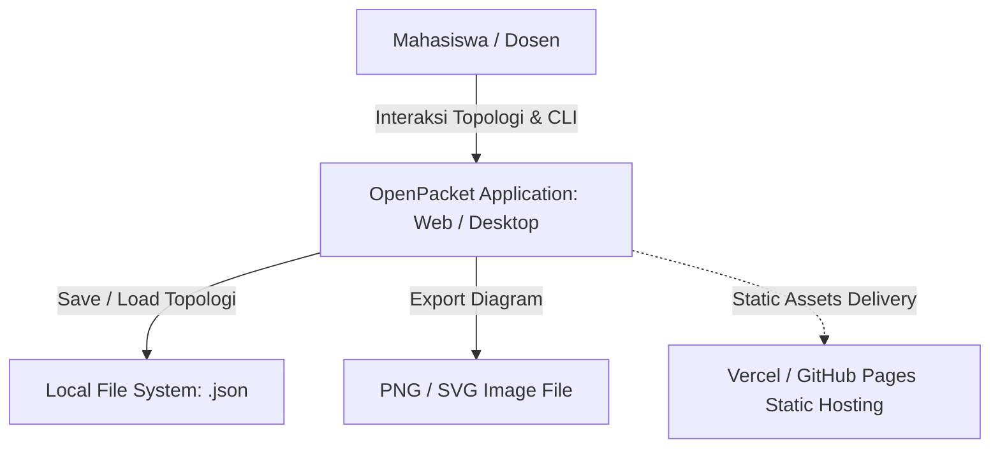
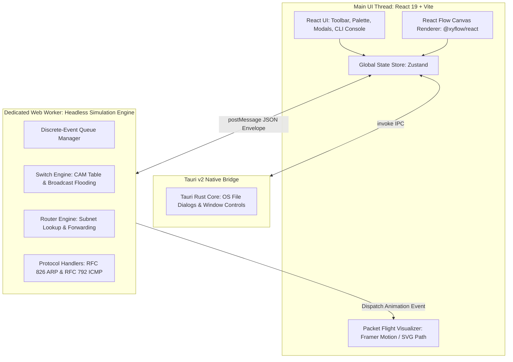
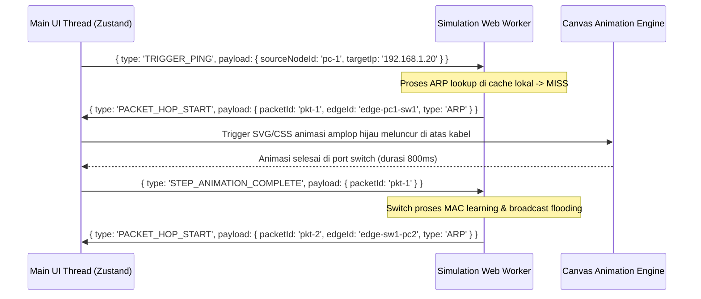

# ARCHITECTURE: System Architecture & Technical Specifications

> **Project:** OpenPacket — Lightweight Educational Network Simulator  
> **Document ID:** DOC-ARCH-001  
> **Version:** 1.0.0  
> **Status:** Draft  
> **Owner:** Software Architect & Project Planning Lead  
> **Last Updated:** 2026-09-05  
> **Depends On:** DOC-SRS-001, DOC-PRD-INDEX-001  
> **Supersedes:** None  

---

## 1. System Context Diagram (C4 Level 1)

Sistem OpenPacket beroperasi secara mandiri (*self-contained client application*) pada runtime peramban web modern atau desktop native wrapper.



---

## 2. Container & Module Diagram (C4 Level 2)

Aplikasi dibangun menggunakan prinsip **Modular Monorepo** dengan pemisahan tegas antara antarmuka (UI Thread), manajemen state aplikasi (Zustand Store), dan komputasi protokol jaringan (Web Worker Engine).



---

## 3. Technology Stack & Decision Summary

| Layer | Teknologi Terpilih | Justifikasi Teknis | Alternatif Dieliminasi |
|---|---|---|---|
| **UI Framework** | React 19 + TypeScript | Ekosistem kuat, modularitas tinggi, cocok untuk antarmuka interaktif kompleks | Vue 3, Svelte (React lebih mapan untuk ekosistem diagram) |
| **Canvas Engine** | React Flow (`@xyflow/react` v12) | Built-in node drag/drop, port handles, zoom/pan, dan rendering berbasis SVG/HTML | Konva.js (terlalu banyak boilerplate), JointJS (lisensi berbayar) |
| **Desktop Wrapper** | Tauri v2 (Rust-backed) | Ukuran file sangat kecil (~15 MB), konsumsi RAM rendah (~30 MB), native file dialog | Electron (ukuran >150 MB, konsumsi RAM tinggi) |
| **State Management** | Zustand | Sangat ringan (<3KB), unopinionated, performa tinggi tanpa boilerplate Redux | Redux Toolkit (terlalu berat), Context API (re-render issue) |
| **Simulation Core** | TypeScript di Web Worker | Eksekusi komputasi protokol terisolasi tanpa pernah membekukan (*freeze*) 60 FPS UI thread | Server API (butuh biaya server 24/7, tidak bisa offline) |
| **Styling** | Tailwind CSS v4 + Lucide Icons | Utility-first CSS, styling cepat, dark-mode ready, bundle purge efisien | CSS Modules murni (lebih lambat dikembangkan solo) |
| **Build & Test Tool** | Vite + Vitest | HMR super cepat, eksekusi unit test instan untuk logika protokol jaringan | Webpack, Jest (lambat) |

---

## 4. Module Boundaries & Communication Model

### 4.1 Sinkronisasi State (Zustand Store Slices)
State aplikasi dibagi menjadi 3 slice independen:
1. `topologySlice`: Menyimpan array `nodes` (koordinat, nama, tipe perangkat, daftar port fisik) dan `edges` (kabel penghubung).
2. `deviceConfigSlice`: Menyimpan konfigurasi logical perangkat (IPv4, Subnet Mask, Gateway, status UP/DOWN port, riwayat perintah CLI).
3. `simulationSlice`: Menyimpan status simulasi aktif (`IDLE`, `RUNNING`, `PAUSED`), daftar paket yang sedang meluncur (*in-flight*), kecepatan simulasi, dan log hasil `ping`.

### 4.2 Web Worker IPC Communication Model
Komunikasi antara thread utama dan worker engine sepenuhnya asinkron menggunakan protokol pesan bertipe tegas (*type-safe tagged union*):



---

## 5. Directory Structure (Monorepo Layout)

```text
cisco-pocket-op/
├── .github/
│   └── workflows/
│       ├── web-deploy.yml         # CI/CD: Deploy static site ke GitHub Pages / Vercel
│       └── tauri-release.yml      # CI/CD: Automated build installer .exe Windows
├── src/
│   ├── assets/                    # Icon SVG perangkat (Router, Switch, PC, Cable)
│   ├── components/
│   │   ├── canvas/                # React Flow custom nodes, custom edges, minimap
│   │   ├── modal/                 # Dialog konfigurasi perangkat (GUI Form)
│   │   ├── terminal/              # Mini Cisco IOS terminal emulator component
│   │   ├── toolbar/               # Header menu (Save, Load, Play, Pause, Speed)
│   │   └── palette/               # Toolbox daftar perangkat untuk di-drag
│   ├── engine/                    # HEADLESS SIMULATION CORE (Bisa diuji tanpa browser DOM)
│   │   ├── worker.ts              # Web Worker entry point & message router
│   │   ├── eventQueue.ts          # Discrete-event queue scheduler
│   │   ├── layers/
│   │   │   ├── ethernet.ts        # L2 framing & Switch CAM table logic
│   │   │   ├── arp.ts             # RFC 826 ARP state machine & cache
│   │   │   ├── ipv4.ts            # RFC 791 IPv4 routing & subnet calculator
│   │   │   └── icmp.ts            # RFC 792 Echo Request & Reply logic
│   │   └── deviceState.ts         # Virtual device memory models
│   ├── store/                     # Global state management
│   │   ├── useAppStore.ts         # Zustand root store
│   │   ├── topologySlice.ts
│   │   └── simulationSlice.ts
│   ├── types/                     # TypeScript shared interfaces (Packets, Nodes, Cables)
│   ├── utils/                     # IP address parsing, CIDR calculator, file export helper
│   ├── App.tsx                    # Root UI layout
│   └── main.tsx                   # React DOM render entry point
├── src-tauri/                     # TAURI V2 DESKTOP WRAPPER (Rust)
│   ├── src/
│   │   └── main.rs                # Native OS bridge (Native Save/Load dialogs)
│   ├── tauri.conf.json            # Desktop app window, permissions, & icon config
│   └── Cargo.toml                 # Rust dependencies
├── tests/
│   ├── unit/                      # Unit tests untuk ARP, ICMP, Subnetting via Vitest
│   └── e2e/                       # Playwright canvas & CLI tests
├── package.json
├── tsconfig.json
└── vite.config.ts
```

---

## 6. Global Technical Invariants (`INV-001` – `INV-008`)

Seluruh agen dan pengembang yang menulis kode untuk proyek ini wajib mematuhi *Global Invariants* berikut:

- `INV-001` **Zero DOM in Engine:** Seluruh file di dalam folder `src/engine/` tidak boleh mengimpor React, hook UI, atau mengakses objek `window`/`document`. Engine harus 100% *pure TypeScript* yang dapat dijalankan di lingkungan Node.js/Web Worker murni.
- `INV-002` **Contract-First IPC:** Setiap penambahan perintah simulasi wajib didaftarkan terlebih dahulu di enum tipe `WorkerInboundMessage` dan `WorkerOutboundMessage` di `src/types/ipc.ts`.
- `INV-003` **Port Cardinality Rule:** Satu port fisik perangkat hanya dapat memiliki relasi ke tepat satu ujung kabel (`connectedEdgeId`). Tidak ada port yang dapat bercabang dua.
- `INV-004` **Deterministic Simulation:** Diberikan topologi dan konfigurasi IP yang sama, simulasi `ping` harus menghasilkan urutan paket dan status kelulusan yang persis identik pada setiap eksekusi.
- `INV-005` **No Proprietary Cisco Code:** Semua kode parser CLI dan model state ditulis murni dari nol (*clean-room implementation*) tanpa menyalin dekompilasi binary Cisco IOS atau Cisco Packet Tracer.
- `INV-006` **Single Source of Configuration Truth:** Konfigurasi IP perangkat yang diubah via Form GUI harus langsung memperbarui state memori yang sama yang dibaca oleh terminal CLI, dan sebaliknya.
- `INV-007` **No Hardcoded Credentials:** Tidak ada secret, token, atau credential apa pun di dalam kode sumber maupun file dokumentasi.
- `INV-008` **Graceful Offline Mode:** Tidak ada komponen fungsional inti yang boleh gagal berjalan jika perangkat pengguna terputus sepenuhnya dari internet.

---

## 7. Scaling Triggers & Complexity Budget

### 7.1 Complexity Budget
- Jumlah third-party npm runtime dependencies dibatasi maksimal **12 library** pada fase P0 guna menjaga bundle size tetap di bawah 2 MB gzipped.
- Dilarang menambahkan framework backend (Express/Nest.js/FastAPI) atau basis data eksternal (PostgreSQL/MongoDB) pada fase P0 dan P1 karena melanggar arsitektur *zero-cost static client*.

### 7.2 Scaling Limits (Kapasitas Maksimal Client)
- **Batas Aman Topologi:** 30 Perangkat Jaringan (Node) dan 50 Kabel Koneksi (Edge). Melebihi batas ini, sistem akan menampilkan notifikasi *Performance Warning* untuk mencegah degradasi frame rate canvas pada laptop spek rendah.
- **Batas Antrian Event:** Maksimal 500 paket dalam satu antrean simulasi ICMP berulang untuk mencegah memori heap browser meluap.

---

## 8. Technical Debt Policy (`DEBT-XXX`)

Tech debt yang sengaja diambil untuk mempercepat demonstrasi seminar proposal dicatat dengan ID terstruktur:
- `DEBT-001`: Subnetting dibatasi pada subnet class-based dan CIDR standar (/24 s.d. /30); perutean VLSM kompleks di luar batas ini belum dioptimasi. (Rencana pelunasan: Milestone 4).
- `DEBT-002`: Parser CLI menggunakan regex tokenizer sederhana alih-alih grammar parser penuh (seperti Chevrotain/ANTLR). Cukup untuk 10 perintah dasar P0. (Rencana pelunasan: P1).
- `DEBT-003`: Konfigurasi perangkat langsung tersimpan ke memori aktif tanpa pemisahan `running-config` vs `startup-config`. (Rencana pelunasan: P1).
