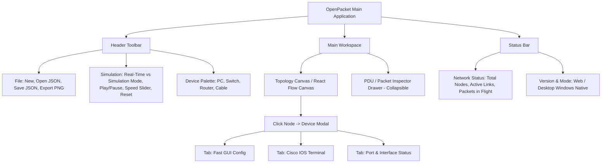

# PLANNING: OpenPacket (Cisco-Pocket-Op)

> **Project:** OpenPacket — Lightweight Educational Network Simulator  
> **Document ID:** DOC-PLANNING-001  
> **Version:** 1.0.0  
> **Status:** Draft  
> **Owner:** Software Architect & Project Planning Lead  
> **Last Updated:** 2026-09-05  
> **Depends On:** DOC-MANIFEST-001  
> **Supersedes:** None  

---

## 1. Executive Summary

**OpenPacket** adalah simulator jaringan komputer interaktif berbasis web dan desktop yang dirancang khusus untuk memenuhi kebutuhan media pembelajaran dan penelitian skripsi di bidang Teknik Informatika / Sistem Komputer. Mengatasi kendala simulator konvensional seperti Cisco Packet Tracer yang mewajibkan instalasi software desktop berat (~500 MB+), memerlukan login akun NetAcad, dan bersifat *closed-source*, OpenPacket menyajikan pengalaman visual drag-and-drop topologi jaringan yang instan diakses via browser modern serta dapat diinstal secara portabel di lingkungan desktop tanpa ketergantungan server eksternal.

Aplikasi mengimplementasikan *discrete-event simulation engine* deterministik (L2/L3) pada sisi client (Web Worker) yang mensimulasikan protokol standar RFC (Ethernet, ARP, IPv4, dan ICMP Ping) dengan visualisasi animasi perpindahan paket data real-time, konfigurasi dual-mode (GUI form & Cisco IOS-style CLI), serta kemampuan penyimpanan topologi lokal.

---

## 2. Problem Statement & Opportunity

### 2.1 Problem Statement
1. **Barrier to Entry Tinggi**: Mahasiswa dan siswa SMK/TKJ sering kesulitan menginstal Cisco Packet Tracer di perangkat dengan keterbatasan spesifikasi teknis atau hak akses administrator (misal di PC lab kampus).
2. **Proprietary & Bloated**: Simulator proprietary memerlukan instalasi berat, dependensi pustaka OS tertentu, serta keharusan autentikasi akun Cisco NetAcad yang sering terkendala jaringan lambat.
3. **Ketiadaan Alternatif Web yang Portabel**: Sebagian besar simulator jaringan open-source lain (seperti GNS3 atau EVE-NG) memerlukan setup virtual machine (VM/QEMU) yang rumit dan berat, bukan media simulasi interaktif cepat untuk kebutuhan belajar konsep dasar routing & switching.

### 2.2 Opportunity & Academic Contribution (Skripsi)
- **Aksesibilitas Universal**: Menghadirkan simulator zero-install yang dapat dijalankan langsung di browser apa pun atau diunduh sebagai desktop app ultra-ringan (~15 MB via Tauri).
- **Kontribusi Akademik**: Pembuktian implementasi *state machine* protokol jaringan (RFC 826 ARP dan RFC 792 ICMP) murni di lingkungan web runtime dengan akurasi transmisi paket 100% identik dengan standar referensi industri.

---

## 3. Objectives & Success Metrics

### 3.1 Objectives
- **OBJ-1**: Membangun antarmuka canvas interaktif untuk manipulasi topologi jaringan (Router, Switch, PC, kabel virtual) dengan responsivitas 60 FPS.
- **OBJ-2**: Mengembangkan simulasi protokol L2 (Ethernet, ARP, Switch MAC Table Learning) dan L3 (IPv4 Static Routing, ICMP Echo Request/Reply).
- **OBJ-3**: Menyediakan visualisasi animasi alur paket (PDU) dan antarmuka konfigurasi perangkat dual-mode (GUI + mini Cisco IOS CLI).
- **OBJ-4**: Menyediakan build multi-distribusi: Web Static App dan Desktop Executable Windows `.exe` berbasis basis kode tunggal (monorepo).

### 3.2 North Star Metric
$$\text{Simulated Packet Delivery Accuracy Rate} = \left( \frac{\text{Jumlah Skenario Pengujian RFC yang Valid}}{\text{Total Skenario Standar RFC 826 \& RFC 792}} \right) \times 100\%$$
- **Target:** **100%** akurasi pada topologi standar (Single LAN, Switch Switching, dan Dual-LAN terhubung 1 Router).

### 3.3 Secondary Metrics
- **Canvas Interaction Latency:** < 16ms (fluid 60 FPS pada topologi hingga 30 node & 50 link).
- **Desktop Bundle Footprint:** Ukuran installer Windows `.exe` ≤ 20 MB (efisiensi >90% dibanding Electron/Packet Tracer).
- **Usability Benchmark (SUS Score):** Rata-rata skor System Usability Scale ≥ 75 dari hasil kuesioner uji coba mahasiswa.

---

## 4. Target Users & Stakeholders

### 4.1 Target Users
1. **Mahasiswa Informatika / Ilmu Komputer / Siswa TKJ**:
   - Membutuhkan simulator cepat untuk praktikum konfigurasi IP, subnetting, pengkabelan, dan pengujian `ping`.
   - Menggunakan perangkat laptop dengan variasi spesifikasi (mulai dari laptop low-end hingga modern).
2. **Dosen / Asisten Laboratorium Jaringan**:
   - Membutuhkan media demonstrasi interaktif saat mengajar di kelas tanpa terkendala masalah lisensi atau instalasi software mahasiswa.

### 4.2 Stakeholders
- **Peneliti / Mahasiswa Pengembang**: Bertindak sebagai Software Architect & Lead Developer.
- **Dosen Pembimbing Skripsi**: Memastikan metodologi perancangan perangkat lunak, keakuratan protokol jaringan, dan struktur naskah ilmiah memenuhi standar akademik.
- **Dosen Penguji Seminar Proposal / Sidang Skripsi**: Menilai aspek kebaruan (*novelty*), metodologi pengujian, validitas fungsional sistem, dan kontribusi ilmiah.

---

## 5. Scope Definition

### 5.1 P0 Scope (Must-Have — MVP-Blocking untuk Seminar Proposal & Demo)
- **Topologi Canvas Visual**: Drag-and-drop penambahan, perpindahan, dan penghapusan perangkat (Router, Switch, PC/Host).
- **Pengkabelan Interaktif**: Koneksi kabel antar-port (FastEthernet/GigabitEthernet) dengan validasi ketersediaan port kosong dan status link (UP/DOWN).
- **Dual-Mode Device Configuration**:
  - *GUI Modal*: Form pengisian IP Address, Subnet Mask, Default Gateway, dan status port (On/Off).
  - *Mini Cisco IOS CLI*: Terminal emulasi interaktif dengan mode berjenjang (User EXEC `>`, Privileged EXEC `#`, Global Config `(config)#`, Interface Config `(config-if)#`) yang mendukung perintah: `enable`, `configure terminal`, `interface <name>`, `ip address <ip> <mask>`, `no shutdown`, `show ip interface brief`, `show ip route`, dan `ping <ip>`.
- **Simulation Engine Deterministik**:
  - *Switch Learning*: Pembentukan tabel MAC address secara otomatis berdasarkan frame yang masuk.
  - *ARP Resolution*: Mekanisme ARP broadcast dan ARP unicast reply untuk pemetaan IP-to-MAC.
  - *IPv4 Static Forwarding*: Pengecekan subnet mask dan perutean antar-interface router.
  - *ICMP Echo*: Siklus pengiriman request dan reply dengan verifikasi round-trip time (RTT).
- **Visual Packet Animation**: Animasi partikel/amplop visual yang meluncur di atas kabel koneksi disertai visualisasi status (sukses/terkirim/drop).
- **Penyimpanan Topologi Lokal**: Fitur Export/Save topologi ke file `.json` dan Import/Load topologi dari file `.json`.
- **Multi-Distribution Packaging**: Deployment versi Web ke hosting statis (Vercel/GitHub Pages) serta paket installer desktop Windows (`.exe`) via Tauri.

### 5.2 P1 Scope (Fast-Follow untuk Sidang Skripsi Lengkap)
- **Step-by-Step PDU Packet Inspector**: Panel detail untuk memeriksa isi struktur header OSI Layer (Layer 2 Ethernet Header, Layer 3 IPv4 Header, Layer 4 ICMP payload) pada setiap hop paket.
- **Visual Table Viewer**: Panel inspeksi interaktif untuk melihat isi tabel MAC Address Switch, ARP Cache PC/Router, dan Tabel Routing Router secara real-time.
- **Layanan DHCP Sederhana**: Router bertindak sebagai DHCP server dan PC dapat dikonfigurasi menggunakan opsi DHCP untuk memperoleh IP otomatis.
- **Mode Lab Praktikum (Guided Challenge)**: Skenario latihan pre-built dengan topologi terkunci dan kriteria verifikasi otomatis (*"Hubungkan PC-1 ke PC-2 dan perbaiki gateway yang salah"*).

### 5.3 P2 Scope (Backlog Terencana Pasca-Skripsi)
- Simulasi Routing Dinamis (RIPv2 sederhana).
- Simulasi Virtual LAN (VLAN 802.1Q) dan Trunking.
- Kolaborasi real-time multi-user melalui WebRTC data channel.
- Cloud repository untuk membagikan tautan topologi publik.

### 5.4 Out of Scope
- Emulasi binary image Cisco IOS asli (Dynamips/QEMU virtual hardware).
- Protokol enterprise kompleks: BGP, MPLS, OSPF multi-area, VPN IPsec, VoIP, Wireless LAN Controller.
- Simulasi Layer 1 fisik mendalam (redaman sinyal, noise kabel, bit framing error).

---

## 6. Information Architecture & Sitemap

---

## 7. Release Strategy & Milestones

| Milestone | Target Waktu | Deliverable | Kriteria Selesai |
|---|---|---|---|
| **M1: Core Engine & Canvas Prototype** | Minggu 2–4 | Canvas interaktif, Node Router/Switch/PC, Pengkabelan, Model Data Topologi | Node dapat ditaruh, dihubungkan kabel, dan data tersimpan di memory |
| **M2: Dual-Mode Config & CLI Parser** | Minggu 5–6 | Form GUI konfigurasi IP, Terminal Mini Cisco IOS CLI, Interface status UP/DOWN | Perangkat dapat dikonfigurasi melalui form dan perintah CLI |
| **M3: Simulation Engine & Packet Animation (Gate C Demo)** | Minggu 7–8 | Engine L2/L3 di Web Worker, Simulasi ARP + ICMP, Animasi paket di canvas | Skenario Ping PC-ke-PC via Switch dan Router sukses beranimasi |
| **M4: File Persistence & Tauri Desktop Build** | Minggu 9–10 | Save/Load file JSON, Build Tauri `.exe` Windows, Deployment web Vercel | File `.json` dapat diekspor/diimpor; `.exe` berjalan di Windows tanpa install Node.js |
| **M5: Evaluasi Akademik & UAT Skripsi (Gate D)** | Minggu 11–12 | Laporan pengujian komparasi vs Cisco Packet Tracer & kuesioner SUS mahasiswa | Akurasi protokol 100%; naskah Bab 3 & 4 skripsi siap sidang |

---

## 8. Effort Basis & Constraints

- **Effort Basis:** Dikerjakan oleh 1 orang (Solo Developer / Peneliti Skripsi) dengan alokasi waktu 15–20 jam per minggu.
- **Budget Constraint:** Rp 0 (Semua perkakas bersifat FOSS, static web hosting gratis di Vercel/GitHub Pages, zero database cost).
- **Platform Constraint:** Desktop build ditargetkan untuk Windows 10/11 64-bit (OS dominan lab komputer kampus); Web app mendukung Google Chrome, Microsoft Edge, Firefox, dan Safari.
- **Legal/IP Constraint:** Proyek menggunakan penamaan independen (*OpenPacket*) tanpa mencatut logo resmi atau kode berhak cipta milik Cisco Systems.

---

## 9. Assumption Register

| ID | Asumsi | Rasionale | Dampak Jika Salah | Tingkat Kepercayaan |
|---|---|---|---|---|
| `ASM-001` | Seluruh simulasi komputasi jaringan dapat dijalankan di sisi client (Web Worker) | Mengeliminasi biaya sewa server, mendukung 100% offline, menjamin privasi | High | High |
| `ASM-002` | Single codebase berbasis React + Vite + Tauri v2 mampu menghasilkan web dan desktop secara konsisten | Menghindari duplikasi logika simulasi antara web dan desktop | High | High |
| `ASM-003` | Protokol P0 cukup mencakup L2 Ethernet/ARP dan L3 IPv4 Static/ICMP | Representasi fundamental pengujian jaringan pada seminar proposal | Medium | High |
| `ASM-004` | Format serialisasi JSON lokal mencukupi kebutuhan penyimpanan topologi | Menghilangkan kebutuhan sistem login dan basis data cloud pada tahap MVP | Low | High |

---

## 10. Risk Register & Mitigasi

| ID | Deskripsi Risiko | Severity | Rencana Mitigasi |
|---|---|---|---|
| `RSK-001` | State simulasi bercampur dengan state rendering React UI sehingga menimbulkan *spaghetti code* | High | Terapkan arsitektur modular murni: *Simulation Engine* adalah *headless TypeScript library* terpisah dari komponen UI React Flow. |
| `RSK-002` | Pertanyaan penguji mengenai keabsahan ilmiah (*academic rigor*) sistem simulasi | High | Sediakan bab evaluasi khusus pada dokumen `TESTING.md` yang memetakan perilaku paket secara formal terhadap RFC 826 dan RFC 792 serta matriks perbandingan head-to-head terhadap Cisco Packet Tracer. |
| `RSK-003` | Divergensi performa animasi saat topologi memiliki banyak koneksi kabel | Medium | Gunakan teknik lightweight SVG path interpolation atau Canvas particle rendering untuk visualisasi paket, serta jalankan kalkulasi rute di Web Worker. |
| `RSK-004` | Kompleksitas pembuatan parser Cisco IOS CLI | Medium | Batasi tatabahasa (*grammar*) CLI hanya pada subset perintah esensial dengan finite state machine (FSM) tokenizer yang terdefinisi rapi. |

---

## 11. Definition of MVP Success

Aplikasi dinyatakan berhasil mencapai status **MVP Ready for Seminar Proposal** jika seluruh kriteria berikut terpenuhi:
1. **Fungsional Topologi**: Pengguna dapat menyusun topologi minimal: 2 PC, 1 Switch, dan 1 Router, lalu menghubungkannya dengan kabel virtual.
2. **Fungsional Konfigurasi**: Pengguna dapat mengatur IP/Subnet pada interface perangkat baik menggunakan GUI form maupun perintah terminal Cisco CLI (`ip address`, `no shutdown`).
3. **Fungsional Simulasi**: Perintah `ping <IP_Tujuan>` dari PC-1 ke PC-2 berhasil memicu siklus ARP request/reply, update switch MAC table, dan ICMP echo request/reply dengan animasi visual paket bergerak di atas kabel tanpa crash.
4. **Fungsional Persistensi**: Topologi dapat disimpan ke file `.json` dan dapat dibuka kembali dengan kondisi konfigurasi perangkat yang persis sama.
5. **Fungsional Distribusi**: Web app dapat diakses secara publik via URL web browser, dan installer desktop `.exe` (ukuran < 20 MB) dapat diinstal dan dijalankan di Windows tanpa internet.
