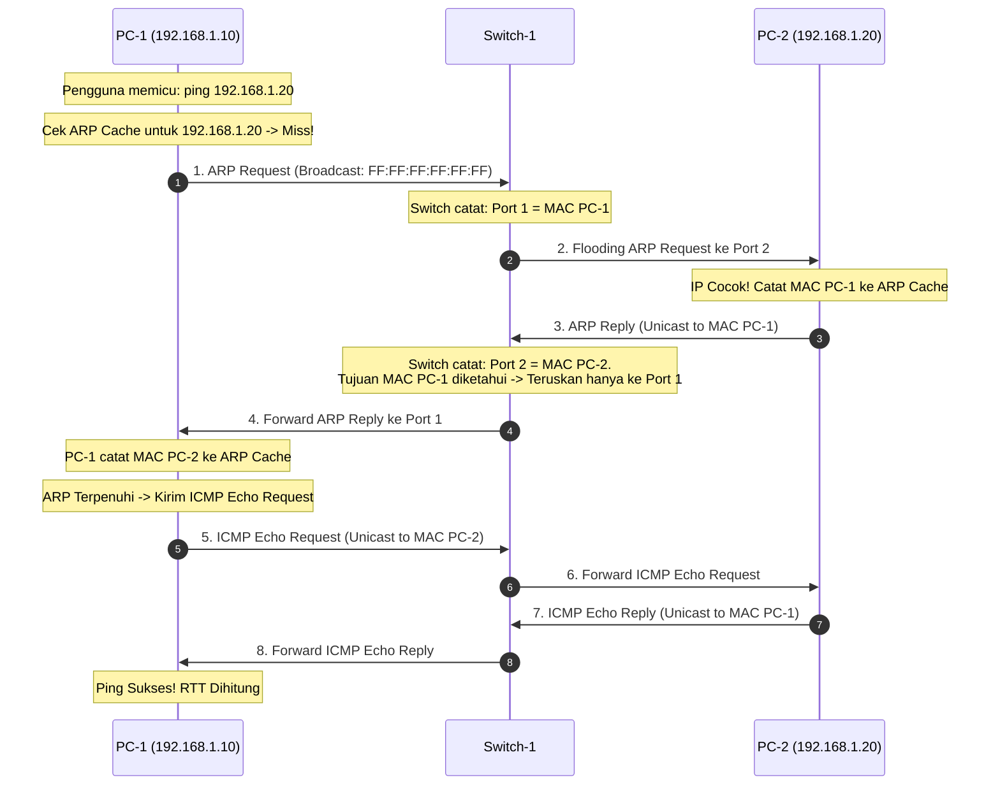

# PRD: Discrete-Event Network Simulation Engine & Protocol Stack

> **Feature ID:** FEAT-SIM-ENGINE  
> **Version:** 1.0.0  
> **Status:** Draft  
> **Priority:** P0  
> **Owner:** Network Protocol & Simulation Architect  
> **Dependencies:** FEAT-CANVAS  
> **Last Updated:** 2026-09-05  

---

## 1. Overview
Fitur ini adalah inti komputasi dari OpenPacket. Mengimplementasikan *discrete-event simulation engine* yang berjalan terisolasi di dalam Web Worker browser/desktop runtime. Modul ini bertanggung jawab memproses protokol Layer 2 (Ethernet, Switch MAC Table Learning) dan Layer 3 (RFC 826 ARP, RFC 791 IPv4 Subnet Routing, RFC 792 ICMP Ping) secara deterministik, serta memancarkan event visual ke thread utama untuk dirender sebagai animasi alur paket.

---

## 2. Goals & Non-Goals
- **Goals:**
  - Menghasilkan simulasi paket data yang 100% patuh pada spesifikasi RFC 826 (ARP) dan RFC 792 (ICMP).
  - Mengimplementasikan algoritma pemelajaran alamat MAC pada Switch (Flooding unknown unicast, dynamic learning, direct forwarding).
  - Menyediakan *event queue* berbasis waktu diskrit sehingga simulasi dapat di-pause, di-step (langkah demi langkah), dan diatur kecepatannya.
  - Menjaga independensi kode simulasi murni (*pure headless library*) agar mudah diuji secara otomatis dengan Vitest.
- **Non-Goals:**
  - Perhitungan transmisi bit layer fisik (CRC32 checksum error injection, frame collision CSMA/CD).
  - Protokol dynamic routing (RIP/OSPF) pada fase P0 (masuk ke P2).
  - Fragmentasi paket IPv4 (semua paket diasumsikan muat dalam standar MTU 1500 bytes).

---

## 3. Actors & Permissions
- **Actors:** Sistem Internal (Web Worker Thread) yang menerima pemicu (*trigger*) dari pengguna (misal: penekanan tombol "Ping" atau eksekusi perintah `ping` di terminal).

---

## 4. Preconditions
- Topologi minimal memiliki 2 perangkat yang telah terhubung kabel dan memiliki alamat IPv4 serta subnet mask yang valid.

---

## 5. User Stories
- **US-SIM-001**: Sebagai mahasiswa, saat saya mengetikkan `ping 192.168.1.2` dari PC-1 ke PC-2, saya ingin melihat paket ARP mencari MAC address terlebih dahulu sebelum paket ICMP dikirimkan.
- **US-SIM-002**: Sebagai mahasiswa, saya ingin melihat Switch meneruskan frame broadcast ke semua port dan kemudian mengingat port asal saat frame balasan diterima.
- **US-SIM-003**: Sebagai dosen, saya ingin menjeda animasi simulasi di tengah jalan agar saya bisa menjelaskan isi header paket kepada mahasiswa.

---

## 6. Functional Protocol Flow



---

## 7. Business & Protocol Rules

### 7.1 Aturan Pemelajaran Switch (MAC Learning)
- `BR-SIM-001`: Saat frame masuk melalui Port $P$, switch membaca `Source MAC Address` ($MAC_S$). Jika entri $[MAC_S, P]$ belum ada, entri tersebut dimasukkan ke MAC Table dengan *timestamp*.
- `BR-SIM-002`: Switch mengevaluasi `Destination MAC Address` ($MAC_D$):
  - Jika $MAC_D$ adalah `FF:FF:FF:FF:FF:FF` (Broadcast), switch menduplikasi frame ke seluruh port aktif kecuali port masuk.
  - Jika $MAC_D$ terdaftar di tabel pada Port $Q$, switch meneruskan frame hanya ke Port $Q$.
  - Jika $MAC_D$ tidak ada di tabel (Unknown Unicast), switch melakukan flooding ke seluruh port aktif kecuali port masuk.

### 7.2 Aturan Resolusi ARP (RFC 826)
- `BR-SIM-003`: Sebelum paket IP dapat di-enkapsulasi menjadi frame Ethernet, node pengirim wajib mengecek ARP Cache lokal untuk menemukan pasangan IP tujuan.
- `BR-SIM-004`: Jika entri tidak ditemukan, paket IP ditunda (*queued*), dan node menembakkan paket ARP Request (`OpCode: 1`) bertipe Broadcast L2.
- `BR-SIM-005`: Hanya node yang memiliki alamat IP sama dengan `Target Protocol Address` yang berhak mengirimkan ARP Reply (`OpCode: 2`) secara unicast.

### 7.3 Aturan Perutean Subnetting & Gateway (RFC 791)
- `BR-SIM-006`: Untuk menentukan hop berikutnya, host melakukan operasi bitwise:
  $$\text{IsLocal} = (IP_{\text{Dest}} \land Mask_{\text{Source}}) == (IP_{\text{Source}} \land Mask_{\text{Source}})$$
  - Jika $\text{IsLocal} == \text{true}$: Paket diarahkan langsung ke $MAC_{\text{Dest}}$.
  - Jika $\text{IsLocal} == \text{false}$: Paket diarahkan ke $MAC_{\text{DefaultGateway}}$. Jika gateway tidak dikonfigurasi, paket di-drop dengan pesan error *"Destination Host Unreachable"*.
- `BR-SIM-007`: Router yang menerima paket IP mengecek tabel routing miliknya (*directly connected interfaces*). Router mengurangi TTL (Time To Live) sebesar 1. Jika $\text{TTL} \le 0$, paket di-drop dengan error *"Time Exceeded"*.

---

## 8. Acceptance Criteria

### AC-SIM-001: First Ping Cycle with ARP
- **Given** PC-1 (`192.168.1.10`) terhubung ke Switch-1 port 1, dan PC-2 (`192.168.1.20`) terhubung ke Switch-1 port 2, dengan ARP cache keduanya masih kosong,
- **When** perintah `ping 192.168.1.20` dijalankan dari PC-1,
- **Then** simulasi harus menghasilkan 4 event paket berurutan:
  1. ARP Request dari PC-1 ke Switch-1, lalu di-flood Switch-1 ke PC-2.
  2. ARP Reply dari PC-2 kembali ke PC-1 via Switch-1.
  3. ICMP Echo Request dari PC-1 ke PC-2 via Switch-1.
  4. ICMP Echo Reply dari PC-2 ke PC-1 via Switch-1.
  Dan console PC-1 mencatat laporan sukses: `Reply from 192.168.1.20: bytes=32 time<1ms TTL=128`.

### AC-SIM-002: Inter-Subnet Routing Via Router
- **Given** PC-1 (`192.168.1.10/24`, GW: `192.168.1.1`) terhubung ke Router `Fa0/0` (`192.168.1.1/24`), dan Router `Fa0/1` (`192.168.2.1/24`) terhubung ke PC-2 (`192.168.2.10/24`, GW: `192.168.2.1`),
- **When** PC-1 melakukan ping ke `192.168.2.10`,
- **Then** paket ICMP berhasil diteruskan melintasi router antar-dua subnet yang berbeda dan reply berhasil diterima kembali oleh PC-1 dengan TTL berkurang 1.

---

## 9. Data Model Struktur Paket Simulasi

```typescript
export interface EthernetFrame {
  id: string;
  sourceMac: string;
  destMac: string; // 'FF:FF:FF:FF:FF:FF' jika broadcast
  etherType: 'ARP' | 'IPv4';
  payload: ArpPacket | IPv4Packet;
}

export interface ArpPacket {
  opCode: 'REQUEST' | 'REPLY';
  senderHardwareAddress: string;
  senderProtocolAddress: string;
  targetHardwareAddress: string;
  targetProtocolAddress: string;
}

export interface IPv4Packet {
  version: 4;
  sourceIp: string;
  destIp: string;
  ttl: number;
  protocol: 'ICMP';
  payload: IcmpPacket;
}

export interface IcmpPacket {
  type: 8 | 0; // 8: Echo Request, 0: Echo Reply
  code: 0;
  sequenceNumber: number;
  identifier: number;
}
```

---

## 10. Web Worker Event Protocol (IPC Message Envelope)

Thread UI utama berkomunikasi dengan Web Worker menggunakan skema canonical message:

```typescript
// Pesan dari UI Thread -> Worker
export type WorkerInboundMessage =
  | { type: 'INIT_TOPOLOGY'; payload: { nodes: NetworkNodeData[]; edges: NetworkEdgeData[] } }
  | { type: 'TRIGGER_PING'; payload: { sourceNodeId: string; targetIp: string } }
  | { type: 'SET_SIMULATION_SPEED'; payload: { speedMultiplier: number } }
  | { type: 'PAUSE_SIMULATION' }
  | { type: 'RESUME_SIMULATION' }
  | { type: 'RESET_SIMULATION' };

// Pesan dari Worker -> UI Thread
export type WorkerOutboundMessage =
  | { type: 'PACKET_HOP_START'; payload: { packetId: string; edgeId: string; fromNodeId: string; toNodeId: string; packetType: 'ARP' | 'ICMP'; frame: EthernetFrame } }
  | { type: 'PACKET_HOP_END'; payload: { packetId: string; edgeId: string; status: 'DELIVERED' | 'DROPPED'; dropReason?: string } }
  | { type: 'PING_RESULT'; payload: { sourceNodeId: string; success: boolean; rttMs: number; outputText: string } }
  | { type: 'TABLE_UPDATED'; payload: { nodeId: string; tableType: 'MAC' | 'ARP' | 'ROUTE'; data: any } };
```
