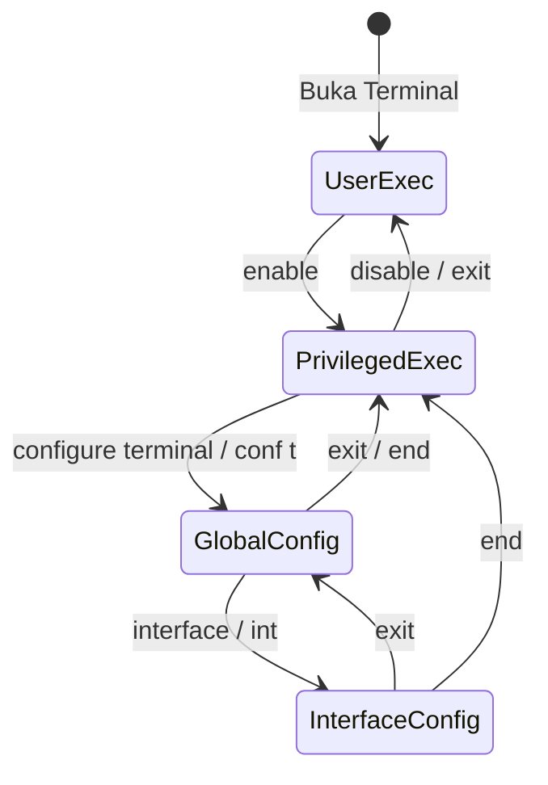

# PRD: Dual-Mode Device Configuration (GUI & Cisco IOS CLI)

> **Feature ID:** FEAT-DEV-CONFIG  
> **Version:** 1.0.0  
> **Status:** Draft  
> **Priority:** P0  
> **Owner:** Frontend & CLI Systems Architect  
> **Dependencies:** FEAT-CANVAS  
> **Last Updated:** 2026-09-05  

---

## 1. Overview
Fitur ini menyediakan antarmuka konfigurasi perangkat berfitur ganda (*Dual-Mode*): antarmuka formulir visual (GUI Form) untuk kemudahan pemula, dan terminal emulasi mini berbasis baris perintah bergaya Cisco IOS (CLI Terminal) untuk pengalaman praktikum jaringan yang autentik. Setiap perubahan yang dilakukan melalui GUI akan langsung tercermin pada konfigurasi internal dan riwayat CLI, dan sebaliknya (*Bi-directional State Synchronization*).

---

## 2. Goals & Non-Goals
- **Goals:**
  - Menyediakan modal dialog perangkat dengan dua tab: **"Config (GUI)"** dan **"CLI (Terminal)"**.
  - Menyediakan validasi input IPv4 dan Subnet Mask desimal bertitik secara real-time.
  - Mengimplementasikan finite state machine (FSM) untuk hirarki prompt Cisco IOS (`>`, `#`, `(config)#`, `(config-if)#`).
  - Mendukung subset perintah konfigurasi esensial: `enable`, `configure terminal`, `interface <name>`, `ip address <ip> <mask>`, `no shutdown`, `shutdown`, `exit`, `end`.
  - Mendukung perintah verifikasi: `show ip interface brief`, `show ip route`, dan `ping <ip>`.
- **Non-Goals:**
  - Dukungan untuk ratusan perintah enterprise Cisco yang kompleks (seperti ACL, NAT, STP, VTP, BGP).
  - Penyimpanan berkas NVRAM `startup-config` vs `running-config` yang terpisah (perubahan langsung disimpan ke *active state* perangkat pada P0).

---

## 3. Actors & Permissions
- **Actor:** Local User (Mahasiswa/Dosen yang mengklik perangkat).

---

## 4. Preconditions
- Pengguna telah mengklik node perangkat di canvas untuk membuka dialog konfigurasi.

---

## 5. User Stories
- **US-CONFIG-001**: Sebagai mahasiswa pemula, saya ingin mengisi IP Address dan Subnet Mask lewat kotak isian form agar saya tidak terhambat oleh hafalan perintah teks.
- **US-CONFIG-002**: Sebagai mahasiswa yang sedang menyiapkan sertifikasi/praktikum, saya ingin mengetikkan perintah `enable`, `conf t`, dan `ip address` di terminal agar terbiasa dengan sintaks Cisco IOS asli.
- **US-CONFIG-003**: Sebagai pengguna, saya ingin memeriksa apakah port router saya sudah aktif melalui perintah `show ip interface brief`.

---

## 6. CLI Command Hierarchy & Grammar State Machine



### Kamus Perintah yang Didukung (Grammar Parser)

| Mode Prompt | Format Perintah | Alias / Shortcut | Aksi & Dampak |
|---|---|---|---|
| `Router>` | `enable` | `en` | Pindah ke Privileged EXEC mode (`Router#`) |
| `Router#` | `configure terminal` | `conf t` | Pindah ke Global Config mode (`Router(config)#`) |
| `Router#` | `show ip interface brief` | `sh ip int br` | Menampilkan tabel IP dan status port UP/DOWN |
| `Router#` | `show ip route` | `sh ip ro` | Menampilkan daftar subnet yang terhubung langsung |
| `Router#` | `ping <ip>` | `ping <ip>` | Memulai simulasi ICMP ping dari perangkat ini |
| `Router(config)#`| `interface <nama_port>` | `int <nama_port>` | Pindah ke Interface Config mode (`Router(config-if)#`) |
| `Router(config)#`| `hostname <nama>` | `host <nama>` | Mengubah nama perangkat pada canvas & prompt |
| `Router(config)#`| `exit` | `exit` | Kembali ke Privileged EXEC mode |
| `Router(config-if)#`| `ip address <ip> <mask>`| `ip add <ip> <mask>`| Menetapkan alamat IP dan Subnet Mask pada interface aktif |
| `Router(config-if)#`| `no shutdown` | `no shut` | Mengaktifkan interface (`Administrative Status: UP`) |
| `Router(config-if)#`| `shutdown` | `shut` | Mematikan interface (`Administrative Status: DOWN`) |
| `Router(config-if)#`| `exit` | `exit` | Kembali ke Global Config mode |
| `* (Semua)` | `end` | `end` | Langsung lompat kembali ke Privileged EXEC mode |

---

## 7. Business Rules & Synchronizations
- `BR-CONFIG-001`: **Two-Way Sync**: Jika pengguna mengubah IP di GUI Form, state perangkat terupdate dan jika terminal CLI dibuka, perintah `show ip int br` akan menampilkan IP baru tersebut. Sebaliknya, jika pengguna mengetikkan `ip address 192.168.1.1 255.255.255.0` di CLI, nilai pada form GUI akan otomatis terisi dengan nilai tersebut.
- `BR-CONFIG-002`: **Validasi Subnet Mask**: Subnet mask wajib merupakan kombinasi bit 1 kontinu yang valid dalam format desimal bertitik (misal `255.255.255.0`, `255.255.255.128`, dst.). Mask non-standar (misal `255.255.0.255`) akan ditolak dengan pesan kesalahan.
- `BR-CONFIG-003`: **Case-Insensitive Tokenizer**: Perintah tidak membedakan huruf besar dan huruf kecil (`ENABLE`, `Enable`, dan `enable` diperlakukan identik).

---

## 8. Acceptance Criteria

### AC-CONFIG-001: Konfigurasi Interface via CLI
- **Given** pengguna membuka terminal pada node Router-1, berada pada mode `Router-1#`,
- **When** pengguna memasukkan urutan perintah berikut:
  ```text
  conf t
  int fa0/0
  ip address 10.0.0.1 255.255.255.0
  no shut
  end
  ```
- **Then** status interface `fa0/0` berubah menjadi `UP`, alamat IP tercatat `10.0.0.1`, subnet mask tercatat `255.255.255.0`, dan tab GUI Form menampilkan data yang sama.

### AC-CONFIG-002: Eksekusi Diagnostik `show ip interface brief`
- **Given** interface `fa0/0` telah dikonfigurasi `10.0.0.1` dan berstatus `UP`,
- **When** pengguna menjalankan `show ip interface brief` pada mode privileged,
- **Then** terminal mencetak baris output:
  ```text
  Interface              IP-Address      Status                Protocol
  FastEthernet 0/0       10.0.0.1        up                    up      
  FastEthernet 0/1       unassigned      administratively down down    
  FastEthernet 0/2       unassigned      administratively down down    
  ```

---

## 9. UI/UX Specifications

### 9.1 Dialog Layout
- Lebar modal: 680px, Tinggi: 520px, terpusat di layar.
- Tab Header:
  - Tab 1: **"Fast Config"** (Form visual)
  - Tab 2: **"Cisco Terminal (CLI)"** (Emulasi konsol monospaced hitam bergaya terminal CRT)
  - Tab 3: **"Port Status"** (Daftar ringkas koneksi kabel)

### 9.2 Terminal UX
- Font: Monospace (`JetBrains Mono`, `Fira Code`, atau `Courier New`).
- Skema warna: Background hitam (`#121212`), teks hijau phosphor (`#00FF66`) atau abu-abu terang (`#E0E0E0`).
- Fitur keyboard:
  - Tombol panah atas (`ArrowUp`) / bawah (`ArrowDown`) untuk navigasi riwayat perintah sebelumnya (*command history*).
  - Tombol `Tab` untuk melengkapi keyword perintah secara otomatis (*autocomplete basic*).
  - Scroll otomatis selalu mengikuti baris input paling bawah.
