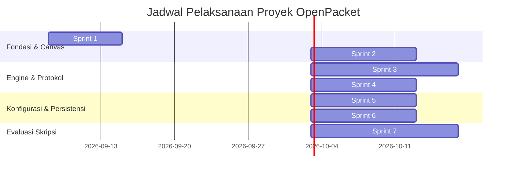

# TASKS: Work Breakdown Structure & Implementation Roadmap

> **Project:** OpenPacket — Lightweight Educational Network Simulator  
> **Document ID:** DOC-TASKS-001  
> **Version:** 1.0.0  
> **Status:** Draft  
> **Owner:** Software Architect & Technical Project Lead  
> **Last Updated:** 2026-09-05  
> **Depends On:** DOC-SRS-001, DOC-ARCH-001  
> **Supersedes:** None  

---

## 1. Roadmap & Sprint Overview

Pengembangan OpenPacket dipecah menjadi 7 sprint berurutan (alokasi total 10–12 minggu kerja dengan kapasitas 15–20 jam/minggu untuk solo developer):

---

## 2. Sprint Task Breakdown

### Sprint 1: Project Setup, Tooling & Design Tokens
- **`TASK-P0-001` [Effort: S] Inisialisasi Vite Monorepo dengan React 19 & TypeScript**
  - *Dependencies:* None
  - *References:* `ARCHITECTURE.md` §5
  - *Definition of Done:* Project terinisialisasi dengan konfigurasi TypeScript ketat (`strict: true`), ESLint, Tailwind CSS v4, dan Vitest runner. Perintah `npm run dev` dan `npm run test` berjalan sukses.
- **`TASK-P0-002` [Effort: S] Inisialisasi Tauri v2 Desktop Wrapper**
  - *Dependencies:* `TASK-P0-001`
  - *References:* `ADR/ADR-001-TAURI-REACT-DESKTOP.md`
  - *Definition of Done:* `src-tauri` terkonfigurasi, window terbuka menampilkan halaman React, dan perintah `npm run tauri dev` berhasil memunculkan jendela native desktop di Windows.
- **`TASK-P0-003` [Effort: S] Implementasi Design Tokens & Layout Shell**
  - *Dependencies:* `TASK-P0-001`
  - *References:* `DSD.md` §2, §3
  - *Definition of Done:* Shell layout (Header Toolbar, Palette Sidebar, Main Workspace, Footer Status Bar) ter-render dengan palet Dark Mode sesuai spesifikasi `DSD.md`.

---

### Sprint 2: React Flow Canvas & Cable Management
- **`TASK-P0-004` [Effort: M] Integrasi `@xyflow/react` & Device Palette**
  - *Dependencies:* `TASK-P0-003`
  - *References:* `PRD/PRD-001-CANVAS-TOPOLOGY.md` §6, `FR-001`
  - *Definition of Done:* Pengguna dapat men-drag item Router, Switch, dan PC dari sidebar palet dan menjatuhkannya (*drop*) ke atas kanvas. Koordinat tersimpan di state.
- **`TASK-P0-005` [Effort: M] Implementasi Custom Node Components dengan Port Handles**
  - *Dependencies:* `TASK-P0-004`
  - *References:* `DSD.md` §4.1, `FR-001`
  - *Definition of Done:* Node Router (3 port), Switch (8 port), dan PC (1 port) ter-render dengan icon representatif, label nama, dan dot handle untuk setiap port fisik.
- **`TASK-P0-006` [Effort: M] Mekanisme Pengkabelan (Custom Edge & Port Binding)**
  - *Dependencies:* `TASK-P0-005`
  - *References:* `PRD/PRD-001-CANVAS-TOPOLOGY.md` §6.1, `FR-003`
  - *Definition of Done:* Menghubungkan dua port memunculkan modal mini pemilihan port kosong, membentuk sambungan kabel, dan mengunci port agar tidak dapat dihubungkan ke kabel lain (*1-to-1 binding*).

---

### Sprint 3: Headless Protocol Engine (L2 & L3)
- **`TASK-P0-007` [Effort: M] Model Data State Jaringan & Port Interfaces**
  - *Dependencies:* `TASK-P0-001`
  - *References:* `ARCHITECTURE.md` §6 (`INV-001`), `PRD-001` §10
  - *Definition of Done:* Interface TypeScript untuk `DevicePort`, `NetworkNodeData`, dan `EthernetFrame` didefinisikan secara murni di `src/engine/types.ts` tanpa ketergantungan DOM.
- **`TASK-P0-008` [Effort: L] Implementasi Switch CAM Learning & Flooding (Layer 2)**
  - *Dependencies:* `TASK-P0-007`
  - *References:* `PRD/PRD-002-SIMULATION-ENGINE.md` §7.1, `FR-008`
  - *Definition of Done:* Logika Switch mencatat source MAC ke CAM table, mem-flood frame unknown unicast/broadcast, dan meneruskan frame secara unicast jika MAC tujuan terdaftar. Seluruh test di `test_switch.ts` lulus.
- **`TASK-P0-009` [Effort: L] Implementasi Protokol ARP (RFC 826)**
  - *Dependencies:* `TASK-P0-007`
  - *References:* `PRD/PRD-002-SIMULATION-ENGINE.md` §7.2, `FR-009`
  - *Definition of Done:* Mesin ARP mampu memancarkan ARP Request broadcast saat cache miss, membalas ARP Reply unicast dari target IP, dan memperbarui ARP cache. Seluruh test di `test_arp.ts` lulus.
- **`TASK-P0-010` [Effort: L] Implementasi IPv4 Subnetting & ICMP Ping (RFC 791 & 792)**
  - *Dependencies:* `TASK-P0-008`, `TASK-P0-009`
  - *References:* `PRD/PRD-002-SIMULATION-ENGINE.md` §7.3, `FR-010`, `FR-011`
  - *Definition of Done:* Logika kalkulator subnetting menentukan gateway/hop lokal. Siklus ICMP Request Type 8 dan Reply Type 0 berhasil dengan dekrementasi TTL router. Seluruh test di `test_ipv4.ts` dan `test_icmp.ts` lulus.

---

### Sprint 4: Web Worker Integration & Packet Animation
- **`TASK-P0-011` [Effort: M] Setup Web Worker & IPC Typed Message Protocol**
  - *Dependencies:* `TASK-P0-010`
  - *References:* `ARCHITECTURE.md` §4.2, `PRD-002` §10
  - *Definition of Done:* Simulasi dipindahkan ke Web Worker terpisah. UI thread mengirimkan pesan `INIT_TOPOLOGY` dan `TRIGGER_PING` serta menerima event hop paket tanpa freeze UI.
- **`TASK-P0-012` [Effort: L] Animasi Aliran Paket pada Custom Edge SVG**
  - *Dependencies:* `TASK-P0-011`, `TASK-P0-006`
  - *References:* `DSD.md` §4.2, `FR-012`
  - *Definition of Done:* Partikel visual amplop (hijau untuk ARP, biru untuk ICMP) bergerak mulus di atas garis kabel React Flow dari node asal ke node tujuan sesuai durasi simulasi.
- **`TASK-P0-013` [Effort: S] Kontrol Simulasi (Play, Pause, Speed Slider, Step)**
  - *Dependencies:* `TASK-P0-012`
  - *References:* `PRD/PRD-002-SIMULATION-ENGINE.md` §2, `FR-013`
  - *Definition of Done:* Pengguna dapat mengatur kecepatan animasi (0.5x s.d. 3x), menjeda simulasi, dan memajukan langkah hop satu demi satu (*Step Mode*).

---

### Sprint 5: Dual-Mode Device Configuration (GUI & CLI)
- **`TASK-P0-014` [Effort: M] Modal Form Konfigurasi Visual (Fast Config)**
  - *Dependencies:* `TASK-P0-005`
  - *References:* `PRD/PRD-003-DEVICE-CONFIG-CLI.md` §9.1, `FR-005`
  - *Definition of Done:* Double-click perangkat membuka modal form untuk mengisi IP, Subnet Mask, Gateway, dan toggle Administrative Status (UP/DOWN) dengan validasi format IP real-time.
- **`TASK-P0-015` [Effort: L] Parser & Tokenizer Mini Cisco IOS CLI**
  - *Dependencies:* `TASK-P0-007`
  - *References:* `PRD/PRD-003-DEVICE-CONFIG-CLI.md` §6, `FR-006`, `FR-007`
  - *Definition of Done:* Parser FSM mendukung hirarki prompt `>`, `#`, `(config)#`, `(config-if)#` dan mengeksekusi perintah: `enable`, `conf t`, `interface`, `ip address`, `no shut`, `show ip int br`, `show ip route`, dan `ping`.
- **`TASK-P0-016` [Effort: M] Komponen Terminal Emulasi & Sinkronisasi Dua Arah**
  - *Dependencies:* `TASK-P0-014`, `TASK-P0-015`
  - *References:* `PRD/PRD-003-DEVICE-CONFIG-CLI.md` §7, `DSD.md` §4.3
  - *Definition of Done:* Antarmuka terminal CRT bergaya monospaced dengan riwayat panah atas/bawah. Perubahan nilai pada form GUI langsung memperbarui terminal dan sebaliknya (*Two-Way Sync*).

---

### Sprint 6: File Persistence & Multi-Platform Packaging
- **`TASK-P0-017` [Effort: M] Ekspor dan Impor File Topologi JSON**
  - *Dependencies:* `TASK-P0-006`, `TASK-P0-014`
  - *References:* `PRD/PRD-001-CANVAS-TOPOLOGY.md` §8 (AC-002), `FR-014`, `FR-015`
  - *Definition of Done:* Tombol Export mengunduh file `.json` berisi seluruh state node, kabel, dan konfigurasi IP. Tombol Import mampu memulihkan kanvas persis ke kondisi tersimpan.
- **`TASK-P0-018` [Effort: M] Integrasi File Dialog Native via Tauri v2 API**
  - *Dependencies:* `TASK-P0-017`, `TASK-P0-002`
  - *References:* `ADR/ADR-001-TAURI-REACT-DESKTOP.md` §5
  - *Definition of Done:* Pada versi desktop, tombol Save/Open memicu dialog native OS Windows (`tauri-plugin-dialog`) dan menulis langsung ke filesystem lokal.
- **`TASK-P0-019` [Effort: M] Setup GitHub Actions CI/CD Pipeline (Web & Windows Executable)**
  - *Dependencies:* `TASK-P0-018`
  - *References:* `ENVIRONMENT.md` §3
  - *Definition of Done:* Workflow GitHub Actions otomatis mendeploy web ke Vercel/GitHub Pages dan mengompilasi rilis `OpenPacket-Setup.exe` pada setiap tag rilis.

---

### Sprint 7: Evaluasi Skripsi (Benchmarking & UAT)
- **`TASK-P0-020` [Effort: L] Eksekusi Pengujian Komparasi vs Cisco Packet Tracer**
  - *Dependencies:* `TASK-P0-013`, `TASK-P0-016`
  - *References:* `TESTING.md` §4
  - *Definition of Done:* 3 skenario topologi standar diuji pada OpenPacket dan Packet Tracer; data paritas urutan paket dan MAC learning dicatat rapi untuk Bab 4 skripsi.
- **`TASK-P0-021` [Effort: M] Pelaksanaan Kuesioner UAT System Usability Scale (SUS)**
  - *Dependencies:* `TASK-P0-019`
  - *References:* `TESTING.md` §5
  - *Definition of Done:* Aplikasi diujikan ke 20–30 mahasiswa; hasil kuesioner 10 instrumen SUS direkapitulasi dan dihitung menghasilkan nilai rata-rata skor SUS.
- **`TASK-P0-022` [Effort: M] Penyusunan Naskah Bab 3 & 4 Skripsi / Seminar Proposal**
  - *Dependencies:* `TASK-P0-020`, `TASK-P0-021`
  - *References:* Seluruh dokumen blueprint
  - *Definition of Done:* Bab Metodologi Penelitian (arsitektur, model protokol RFC) dan Bab Hasil & Pembahasan (tabel komparasi & skor SUS) selesai disusun.
