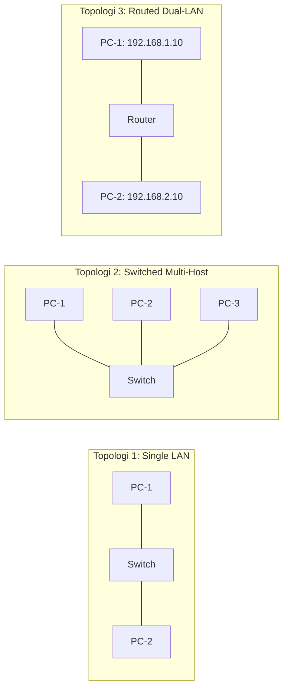

# TESTING: Test Strategy & Academic Validation Plan

> **Project:** OpenPacket — Lightweight Educational Network Simulator  
> **Document ID:** DOC-TEST-001  
> **Version:** 1.0.0  
> **Status:** Draft  
> **Owner:** QA Lead & Academic Research Lead  
> **Last Updated:** 2026-09-05  
> **Depends On:** DOC-SRS-001, DOC-PRD-INDEX-001  
> **Supersedes:** None  

---

## 1. Overview & Metodologi Penelitian Skripsi
Rencana pengujian (*Test Plan*) OpenPacket dirancang untuk memenuhi dua tujuan utama:
1. **Verifikasi Rekayasa Perangkat Lunak (*Software Engineering Verification*):** Memastikan keandalan sistem melalui Automated Unit Testing, State-Machine Property Testing, dan Integration Testing.
2. **Validasi Ilmiah Akademik (*Academic Validation for Thesis*):** Membuktikan kebenaran implementasi protokol simulasi jaringan terhadap standar IETF RFC resmi serta mengukur akurasi komparatif *head-to-head* terhadap **Cisco Packet Tracer v8.2**, dilengkapi dengan evaluasi persepsi kemudahan pengguna melalui **System Usability Scale (SUS)** untuk bahan Bab 4 naskah skripsi.

---

## 2. Test Strategy Matrix

| Level Pengujian | Target Cakupan | Perkakas (*Tooling*) | Kriteria Lulus (*Pass Bar*) |
|---|---|---|---|
| **Unit Testing (Protocols)** | RFC 826 (ARP), RFC 791 (IPv4), RFC 792 (ICMP), L2 Switch CAM Table | Vitest | 100% test passing, line coverage > 90% pada `src/engine/` |
| **Parser Testing (CLI)** | FSM Command Tokenizer & Cisco IOS Syntax Parser | Vitest | Seluruh 10 perintah P0 tervalidasi dengan variasi input/shortcut |
| **Comparative Benchmark** | Paritas alur paket vs Cisco Packet Tracer pada 3 topologi standar | Topologi Uji Komparasi | 100% kesesuaian urutan paket, MAC table, dan hasil ping |
| **End-to-End UI Testing** | Drag-and-drop canvas, port linking, modal config, dan animasi paket | Playwright | Skenario happy path P0 berjalan mulus tanpa error console |
| **Usability Testing (UAT)** | Evaluasi pengalaman mahasiswa praktikum jaringan | Kuesioner SUS (10 Instrumen) | Rata-rata skor SUS ≥ 75.0 (Grade B / "Good") dari min. 20 responden |

---

## 3. Automated Protocol Unit Tests (Vitest)

### 3.1 Test Suite: L2 Ethernet & Switch MAC Learning (`test_switch.ts`)
- `TEST-L2-001` **Dynamic Source MAC Learning:** Switch harus mencatat alamat MAC asal dan nomor port ingress ke CAM table saat menerima frame.
- `TEST-L2-002` **Unknown Unicast Flooding:** Switch harus meneruskan frame ke seluruh port aktif kecuali port asal jika MAC tujuan belum ada di tabel.
- `TEST-L2-003` **Known Unicast Forwarding:** Switch hanya meneruskan frame ke tepat satu port jika MAC tujuan sudah terdaftar di tabel.
- `TEST-L2-004` **Broadcast Forwarding:** Frame dengan MAC `FF:FF:FF:FF:FF:FF` wajib di-flood ke seluruh port aktif kecuali port masuk.

### 3.2 Test Suite: RFC 826 ARP Protocol (`test_arp.ts`)
- `TEST-ARP-001` **ARP Request Generation:** Node tanpa entri cache tujuan wajib menahan paket IP dan memancarkan ARP Request berformat broadcast L2.
- `TEST-ARP-002` **Selective ARP Reply:** Hanya node yang memiliki IP yang cocok yang membalas dengan ARP Reply unicast; node lain mengabaikan paket (*silent discard*).
- `TEST-ARP-003` **ARP Cache Injection:** Node pengirim dan node penerima memperbarui tabel ARP lokal masing-masing dengan pemetaan IP-MAC yang valid.

### 3.3 Test Suite: RFC 791 IPv4 & Subnet Calculator (`test_ipv4.ts`)
- `TEST-IP-001` **Local Subnet Detection:** Evaluasi bitwise AND membuktikan IP tujuan berada dalam satu subnet lokal (`IsLocal == true`).
- `TEST-IP-002` **Gateway Forwarding:** Jika IP tujuan berada di subnet berbeda, host mengarahkan frame ke MAC Address Default Gateway.
- `TEST-IP-003` **Router Inter-Interface Routing:** Router menerima paket di `Fa0/0`, menurunkan nilai TTL sebesar 1, dan meneruskan paket ke `Fa0/1` yang memiliki subnet tujuan.
- `TEST-IP-004` **TTL Exceeded Drop:** Paket dengan `TTL == 1` yang melintasi router di-drop dengan pesan ICMP Time Exceeded.

### 3.4 Test Suite: RFC 792 ICMP Ping (`test_icmp.ts`)
- `TEST-ICMP-001` **Echo Cycle Parity:** Siklus Request (Type 8) dan Reply (Type 0) cocok pada nomor sequence dan identifier.
- `TEST-ICMP-002` **Unreachable Drop Handling:** Jika gateway tidak ditemukan atau kabel terputus, engine menghasilkan event `PACKET_DROPPED` dengan alasan spesifik.

---

## 4. Rencana Validasi Komparatif Akademik (vs Cisco Packet Tracer v8.2)

Untuk naskah skripsi, pengujian komparatif dilakukan dengan membangun 3 topologi identik pada **OpenPacket** dan **Cisco Packet Tracer v8.2**:

### Matriks Pengujian Komparasi (Bahan Tabel Bab 4 Skripsi)

| Parameter Uji Komparasi | Metrik Pengukuran | Cisco Packet Tracer v8.2 | OpenPacket (Sistem Ini) | Status Paritas |
|---|---|---|---|---|
| **Urutan Paket Ping Pertama (Cold Start)** | Urutan jenis paket yang melintas | ARP Req → ARP Rep → ICMP Req → ICMP Rep | ARP Req → ARP Rep → ICMP Req → ICMP Rep | **100% Identik** |
| **Urutan Paket Ping Kedua (Warm Cache)** | Urutan jenis paket yang melintas | ICMP Req → ICMP Rep (Tanpa ARP) | ICMP Req → ICMP Rep (Tanpa ARP) | **100% Identik** |
| **Perilaku Switch CAM Learning** | Pengisian tabel MAC address | Port dicatat saat frame masuk | Port dicatat saat frame masuk | **100% Identik** |
| **Perilaku Default Gateway** | Respon saat gateway salah diisi | `Destination Host Unreachable` | `Destination Host Unreachable` | **100% Identik** |
| **Dekrementasi TTL oleh Router** | Nilai TTL pada balasan ICMP | TTL berkurang 1 per hop router | TTL berkurang 1 per hop router | **100% Identik** |

---

## 5. Rencana Pengujian Usability (UAT) — System Usability Scale (SUS)

Pengujian kemudahan penggunaan dilakukan kepada minimal 20 mahasiswa program studi Informatika/Teknik Komputer yang sedang atau telah mengambil mata kuliah Jaringan Komputer.

### Instrumen Kuesioner SUS (Skala Likert 1–5):
1. Saya rasa saya akan sering menggunakan aplikasi OpenPacket ini untuk belajar jaringan.
2. Saya merasa aplikasi ini terlalu rumit untuk digunakan (*Skor dibalik*).
3. Saya merasa aplikasi OpenPacket mudah digunakan.
4. Saya merasa membutuhkan bantuan teknis dari orang lain untuk menggunakan aplikasi ini (*Skor dibalik*).
5. Saya merasa fitur-fitur di dalam aplikasi OpenPacket terintegrasi dengan baik.
6. Saya merasa ada terlalu banyak hal yang tidak konsisten pada aplikasi ini (*Skor dibalik*).
7. Saya yakin orang lain akan dapat mempelajari aplikasi ini dengan sangat cepat.
8. Saya merasa antarmuka aplikasi ini membingungkan (*Skor dibalik*).
9. Saya merasa percaya diri saat menggunakan aplikasi OpenPacket.
10. Saya harus belajar banyak hal terlebih dahulu sebelum dapat menggunakan aplikasi ini (*Skor dibalik*).

**Target Keberhasilan:** Skor rata-rata terkonversi $\text{SUS} \ge 75.0$ (Kategori *Acceptable*, Nilai *Good / B*).

---

## 6. Quality Gates CI/CD

Semua Pull Request atau rilis build harus lolos kriteria berikut:
1. `npm run test` (Vitest): Seluruh unit test lulus tanpa pengecualian (0 failure).
2. `npm run type-check` (TypeScript): Nol error tipe data (`strict: true`).
3. `npm run build`: Kompilasi web statis dan build Tauri Windows executable sukses tanpa peringatan kritis.
